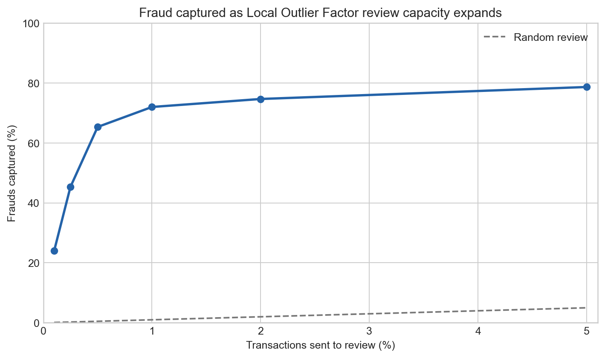
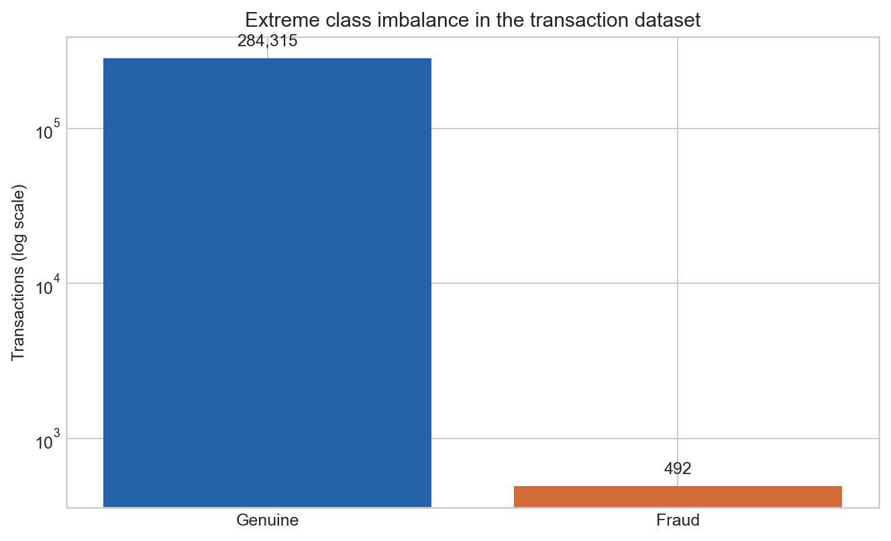
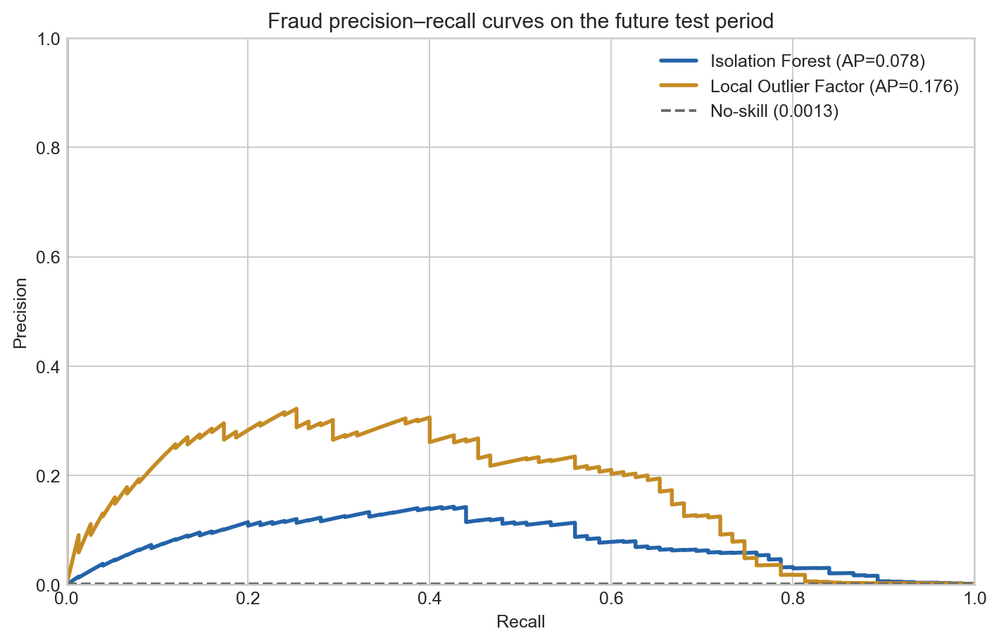
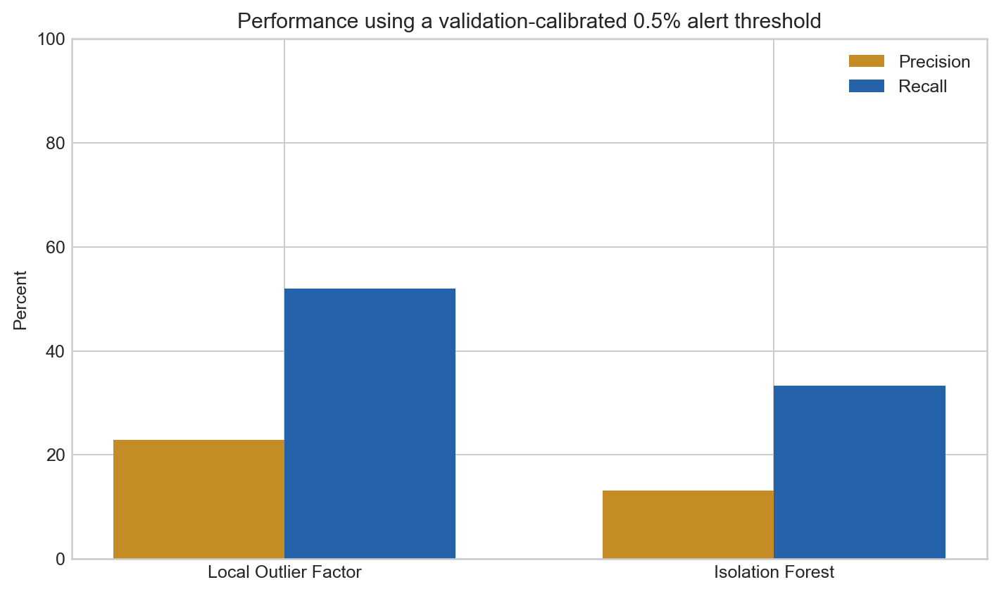

# Credit Card Fraud Anomaly Detection

[](https://github.com/sagarmandavkar-UX/credit-card-fraud-anomaly-detection/actions/workflows/ci.yml)
[](https://www.python.org/)
[](LICENSE)

Can unsupervised anomaly scores concentrate confirmed fraud into a review queue small enough for investigators to handle?

This project compares Isolation Forest and Local Outlier Factor on 284,807 anonymized credit-card transactions. It preserves time order, fits models only on early known-normal transactions, evaluates the extreme class imbalance with precision–recall metrics, and translates model scores into analyst workload.



## Business answer

**Local Outlier Factor was the stronger validation model, but threshold drift matters.**

- Overall fraud prevalence: **0.172%** (492 of 284,807 transactions)
- Future test period: **56,962 transactions and 75 frauds**
- Test PR-AUC: **0.176** versus a 0.132% test-period no-skill rate
- Test ROC-AUC: **0.913**
- Validation-calibrated threshold flagged **170 transactions (0.30%)**
- Those alerts captured **39 frauds (52.0% recall)**
- Alert precision: **22.9%**—about 133 times the full-dataset fraud prevalence
- Reviewing exactly the top **0.5%** of test scores would capture **49 of 75 frauds (65.3%)**

The model is useful as a queue-ranking layer, not a reason to automatically decline transactions. Human review, rules, customer context, costs, and feedback are still required.

## Why accuracy is not reported



A classifier that labels every transaction genuine would exceed 99.8% accuracy while detecting zero fraud. The primary comparison metric is PR-AUC, with precision, recall, false positives, and review volume reported at operational thresholds.

## Dataset

The project uses the [ULB / Worldline Credit Card Fraud Detection dataset](https://www.kaggle.com/datasets/mlg-ulb/creditcardfraud):

- 284,807 European card transactions over two days in September 2013
- 492 confirmed frauds
- 28 anonymized PCA features plus elapsed time and transaction amount
- Public Kaggle download; raw 151 MB CSV is downloaded during setup and CI

See [data/README.md](data/README.md) for provenance, license label, and limitations.

## Evaluation design

```text
Transactions sorted by Time
       │
       ├── Earliest 60%: train
       │      └── fit only on known-normal rows
       ├── Next 20%: validation
       │      ├── select model by PR-AUC
       │      └── calibrate a 0.5% score threshold
       └── Latest 20%: untouched test
              ├── transport validation threshold
              └── analyze exact review-capacity scenarios
```

The time-ordered design is closer to live fraud screening than a random split and exposes score-distribution drift: a threshold targeting 0.5% of validation rows flagged only 0.30% of test rows.

## Model comparison



Local Outlier Factor ranks fraud more effectively by PR-AUC on both validation and test. Isolation Forest has a higher test ROC-AUC, illustrating why ROC-AUC alone can look optimistic under extreme imbalance.



The operating-point chart uses each model’s validation-calibrated threshold. The review-capacity curve separately shows how recall changes if investigators can review an exact fraction of the future batch.

## Why no autoencoder?

An autoencoder is a possible extension, but it is not automatically better. These inputs are already anonymized PCA components; a neural model would add training and tuning complexity without improving explanation quality. The repository focuses on two distinct, reproducible baselines: tree-based isolation and neighborhood density.

## Repository structure

```text
.
├── data/
│   ├── README.md
│   └── raw/                 # downloaded locally, not committed
├── notebooks/fraud_anomaly_detection.ipynb
├── reports/
│   ├── figures/
│   ├── review_capacity_curve.csv
│   ├── test_metrics.csv
│   ├── validation_metrics.csv
│   └── summary.json
├── scripts/
├── src/fraud_detection/
├── tests/
└── MODEL_CARD.md
```

## Run locally

```bash
python -m venv .venv
source .venv/bin/activate
python -m pip install -e ".[dev]"
python scripts/download_data.py
python scripts/run_analysis.py
python scripts/build_notebook.py
jupyter nbconvert --execute --to notebook --inplace notebooks/fraud_anomaly_detection.ipynb
pytest -q
```

## Outputs

- [Executed analysis notebook](notebooks/fraud_anomaly_detection.ipynb)
- [Model card](MODEL_CARD.md)
- [Machine-readable summary](reports/summary.json)
- [Validation metrics](reports/validation_metrics.csv)
- [Future test metrics](reports/test_metrics.csv)
- [Review-capacity analysis](reports/review_capacity_curve.csv)

## Method note

The project brief was informed by [Fraud Detection and Anomaly Detection](https://medium.com/@chenycy/fraud-detection-and-anomaly-detection-e65dd11a3146). The implementation adds time-ordered evaluation, normal-only model fitting, PR-AUC model selection, validation-only threshold calibration, and explicit review-workload analysis. All code, analysis, and writing in this repository are original.

